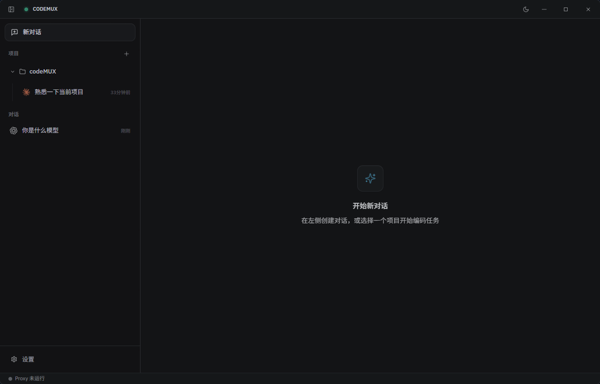
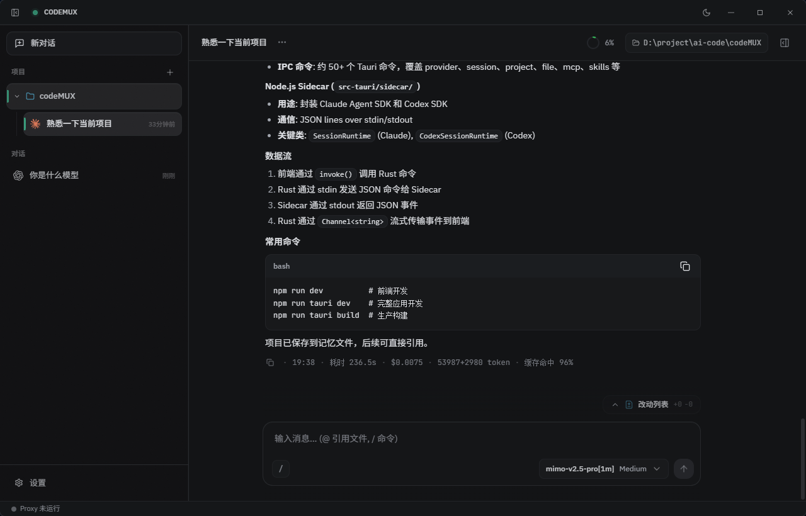
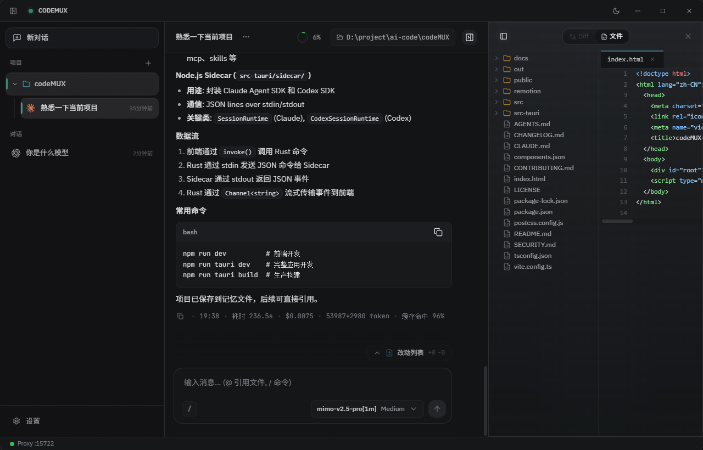
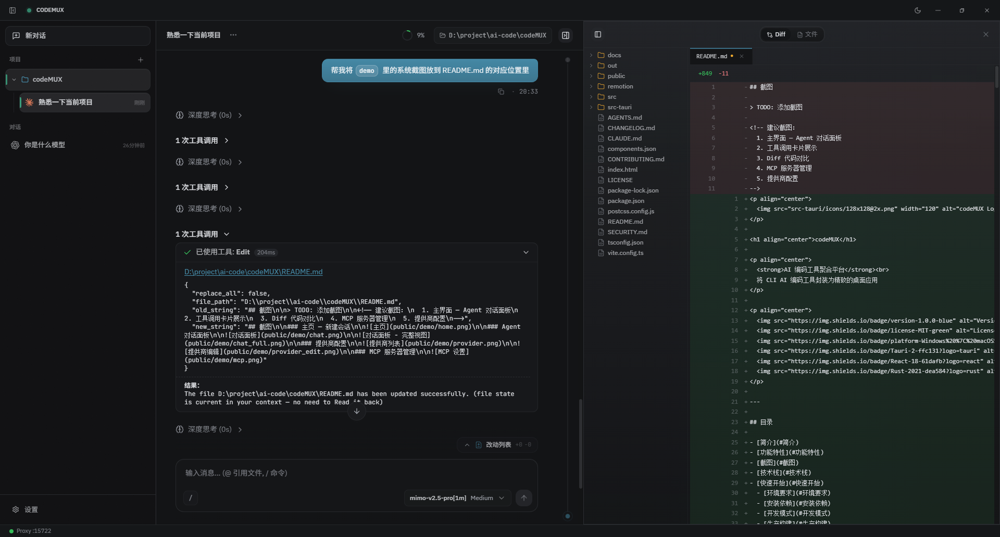
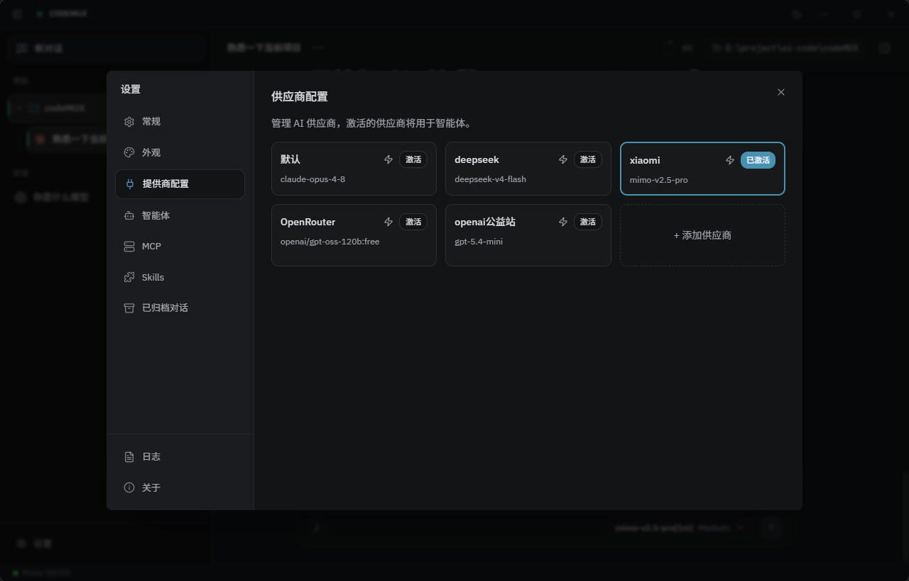
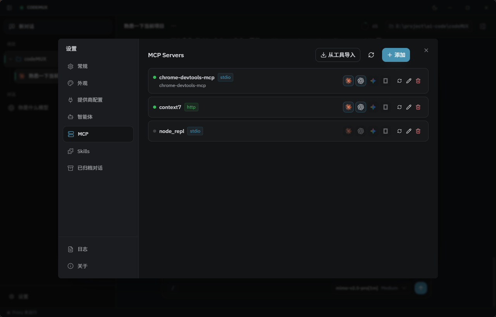
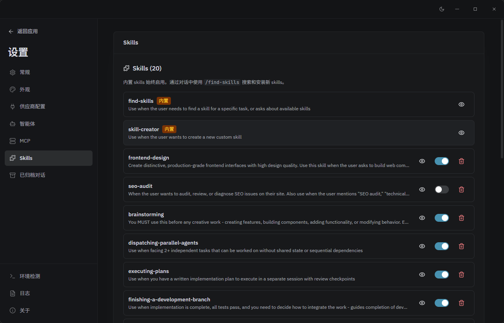

<p align="center">
  
</p>

<h1 align="center">CodeMUX</h1>

<p align="center">
  <strong>一个把 AI 编码 CLI 变成桌面工作台的本地优先应用</strong>
</p>

<p align="center">
  用统一界面管理 Claude Code、Codex、多 Provider、MCP、Skills、Git Review、内置终端与项目会话。
</p>

<p align="center">
  
  
  
  
  
  
</p>

<p align="center">
  <a href="#截图">截图</a> •
  <a href="#当前亮点">当前亮点</a> •
  <a href="#快速开始">快速开始</a> •
  <a href="#架构概览">架构概览</a>
</p>

---

## CodeMUX 是什么

`CodeMUX` 是一个基于 `Tauri 2 + React + Rust` 的跨平台桌面应用，目标不是做一个“再包一层聊天窗口”，而是把真实的 AI 编码工作流搬到一个更顺手的 GUI 里。

如果你平时在 `Claude Code`、`Codex` 这类 CLI 智能体上工作，通常会遇到这些问题：

- 对话、工具调用、文件改动、终端输出分散在不同地方
- 多 provider、多模型、多项目切换成本高
- MCP、Skills、权限模式、历史会话都缺少统一管理入口
- 想做代码审查或开一个项目终端，还要在应用外反复切换

`CodeMUX` 的做法是把这些环节收拢到一个桌面工作台里：会话、项目、Provider、Agent、MCP、Skills、Review、Terminal 都放在同一个界面中完成。

当前真正可用的核心运行时：

- `Claude Code`
- `Codex`

`Gemini CLI` 和 `OpenCode` 已经完成接入位与 MCP 适配位，运行时仍处于预留阶段。

---

## 当前亮点

### 面向真实编码流程，而不是单纯聊天

- 项目分组 + 多会话管理
- 流式对话、Thinking、Todo、工具调用卡片
- 变更文件预览、Diff 展示、子 Agent 结果展示
- 会话归档、置顶、重命名、恢复

### 把 AI 工作流放进同一个桌面壳里

- 内置 `Review` 面板查看 `staged` / `unstaged` 改动
- 内置 `Terminal` 面板在项目目录直接开 PTY 终端
- 右侧 Side Panel 支持多标签切换
- 输入、代码审查、文件变更、终端不用再来回切应用

### 多 Provider 与多模型管理

- 每个 provider 可配置 `API Key`、Anthropic / OpenAI Base URL、模型列表、默认模型、Token 单价
- 支持测试连通性
- 支持从接口拉取模型列表
- 支持 `codex_needs_proxy` 路由开关
- 支持 `1M context` 标记

### 本地代理兼容 Codex

- 内置本地代理路由
- 用于兼容 `Codex SDK` 与非原生 OpenAI Responses API 上游
- 设置页可直接启动 / 停止
- 状态栏可观察运行状态

### MCP 与 Skills 都能在应用内统一管理

- MCP 支持 `stdio`、`http`、`sse`
- 支持 JSON 编辑、配置向导、探测、从本机工具导入
- 每个 MCP 可单独启用到 Claude / Codex / Gemini / OpenCode
- Skills 支持内置同步、预览、启用 / 禁用、卸载
- 启用的 Skills 会自动注册到斜杠命令系统

### 权限模式和计划模式是第一类能力

- Claude 与 Codex 拥有独立的权限配置模型
- 会话级保存权限配置和 `plan mode`
- Codex 支持 sandbox / approval / network access 组合配置
- Claude 支持不同 permission mode

---

## 截图

### 新建会话与项目入口



### 主对话面板





### 文件改动与 Diff



### Provider 配置



### MCP 管理



### Skills 管理



---

## 适合谁

- 经常用 `Claude Code` 或 `Codex` 做工程任务的开发者
- 希望把多 provider、多项目、多会话统一管理的人
- 想要可视化工具调用、Diff、终端与 Review 面板的人
- 希望把 MCP / Skills 当作长期工作流能力来管理的重度用户

---

## 快速开始

### 环境要求

- `Node.js >= 18`
- `Rust stable`
- 对应平台的 `Tauri 2` 前置依赖

Windows 通常还需要：

- Visual Studio C++ Build Tools
- WebView2 Runtime

### 安装依赖

```bash
npm ci
cd src-tauri/sidecar
npm ci
npm run build
cd ../..
```

### 开发模式

```bash
npm run tauri dev
```

如果只开发前端：

```bash
npm run dev
```

### 生产构建

```bash
npm run build
npm run tauri build
```

### 常用检查命令

```bash
# 前端测试
npx vitest run

# sidecar 测试
cd src-tauri/sidecar
npx vitest run

# Rust 检查
cd src-tauri
cargo check --all-targets --all-features
cargo fmt --all -- --check
cargo clippy --all-targets --all-features -- -D warnings
```

---

## 使用概览

### 1. 配置 Provider

在设置中的“供应商配置”里填写：

- `供应商名称`
- `API Key`
- `Anthropic Base URL`
- `OpenAI Base URL`
- `模型列表`

第一行模型会作为默认模型。  
如果目标上游不是原生 OpenAI Responses API，建议开启“需要本地路由映射”。

### 2. 选择默认智能体

在“智能体”设置中选择默认智能体。当前已可用运行时：

- `Claude Code`
- `Codex`

### 3. 管理 MCP

在“MCP”设置中可以：

- 新增 / 编辑 server
- 使用向导生成配置
- 对不同工具单独启用
- 从本机已有工具配置导入
- 执行连接探测

### 4. 打开工作区侧边面板

进入项目会话后，可在右侧 Side Panel 打开：

- `审查`：查看并操作 Git 改动
- `终端`：在项目根目录打开内置终端

---

## 斜杠命令

所有会话都支持一组基础命令：

- `/new`
- `/clear`
- `/compact`
- `/cost`
- `/status`

Claude 当前额外支持的常用命令包括：

- `/init`
- `/review`
- `/code-review`
- `/security-review`
- `/debug`
- `/verify`
- `/deep-research`
- `/simplify`
- `/batch`
- `/loop`
- `/run`
- `/heapdump`
- `/insights`
- `/goal`

Codex 当前额外支持：

- `/plan`
- `/init`
- `/review`

通用自定义命令：

- `/explain <文件路径>`
- `/test`
- `/fix [描述]`
- `/refactor <目标>`

已安装并启用的 Skills 也会注册为斜杠命令。

---

## 技术栈

| 层 | 技术 |
|---|---|
| 前端 | React 18, TypeScript, Vite 6 |
| UI | Tailwind CSS v4, Radix UI, lucide-react |
| 状态管理 | Zustand |
| 对话渲染 | `@assistant-ui/react`, `react-markdown`, `streamdown` |
| 代码 / Diff | CodeMirror, `diff`, `parse-diff`, highlight.js |
| 终端 | `@xterm/xterm`, `@xterm/addon-fit` |
| 桌面壳 | Tauri 2 |
| 后端 | Rust 2021, Tokio, Reqwest, Rusqlite |
| 本地数据库 | SQLite |
| Sidecar | Node.js + TypeScript |
| Agent SDK | `@anthropic-ai/claude-agent-sdk`, `@openai/codex-sdk` |

---

## 配置与数据

应用主要数据保存在本地：

- 会话 / 项目 / MCP / Skills 元数据：`SQLite`
- 提供商、主题、默认智能体等：`config.json`
- Agent 原生历史：由各自运行时和 sidecar 管理

在设置 -> 常规中可以直接查看和打开配置目录。

---

## 架构概览

### 前端

- React 渲染桌面 UI
- Zustand 管理会话、设置、MCP、Skills、侧边面板等状态
- 通过 Tauri IPC 调用 Rust 命令

### Rust 后端

- 管理 SQLite、配置文件、MCP 适配、Git、终端、文件系统
- 管理 sidecar 生命周期
- 作为前端与实际 agent runtime 之间的桥

### Node.js sidecar

- 封装 Claude Code 与 Codex 运行时
- 处理会话启动、流式事件、历史恢复、代理路由等逻辑

---

## 项目结构

```text
codeMUX/
├─ src/                     # React 前端
├─ src-tauri/src/           # Rust 后端
├─ src-tauri/sidecar/src/   # Node.js sidecar
├─ public/                  # 静态资源与截图
├─ docs/                    # 设计文档与实现说明
└─ README.md
```

更细的目录约定请参考 [CONTRIBUTING.md](CONTRIBUTING.md) 和仓库内的 `AGENTS.md` / 开发文档。

---

## 相关文档

- [贡献指南](CONTRIBUTING.md)
- [更新日志](CHANGELOG.md)
- [Codex 路由代理说明](docs/codex-routing-proxy-guide.md)
- [MCP 统一管理说明](docs/mcp-unified-management-guide.md)
- [AI Agent 权限审批说明](docs/ai-agent-permission-approval-guide.md)

---

## 当前状态

- `Claude Code`：主力运行时，支持最完整
- `Codex`：已集成并可用，包含本地代理兼容链路
- `Gemini CLI / OpenCode`：界面与适配位已预留，运行时待继续完善

---

## 许可证

本项目基于 [MIT License](LICENSE) 开源。

---

<p align="center">
  Made by <a href="https://github.com/kfumi">kfumi</a>
</p>
