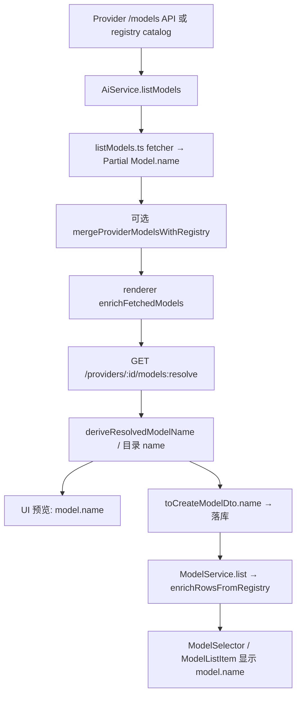

# Cherry Studio：模型服务获取列表后 UI「模型名字」展示规则

> 调研对象：`C:\Users\94910\AppData\Local\Temp\opencode\cherry-studio`（Cherry Studio v2.0.3）  
> 证据来源：项目自身源码（primary sources）  
> 调研日期：2026-08-09

## CodeMUX 落地（轻量注册表）

CodeMUX 未移植 Cherry 完整 `@cherrystudio/provider-registry`，而是在
`src/lib/modelRegistry/` 自建轻量目录：

- `catalog.ts`：自维护 `MODEL_CATALOG` + `PROVIDER_MODEL_OVERRIDES`（与 Cherry curated 名对齐）
  - 覆盖内置供应商：anthropic / openai / deepseek / openrouter / siliconflow / zhipu / opencode-go
- `normalize.ts`：完整移植 Cherry `normalizeModelId`（聚合前缀 / `:free` / quant / 日期 / Bedrock ARN）
- `resolve.ts`：`resolveModelFromRegistry` / `enrichFetchedModels` / `deriveResolvedModelName`
  - 匹配：exact → normalize fallback（与 Cherry registry-loader 同序）
  - fuzzy 装饰：`stripVariantQuantDateSuffixes` + Bedrock revision 余量进 `(suffix)`；`aihubmix-` 等聚合前缀不装饰
- 拉取接入：`ProviderConfig` → `enrichFetchedModels(builtin_template_id, fetched)`
- 展示接入：`resolveModelDisplayName({ id, name, providerTemplateId })`

与 Cherry 对齐的优先级：目录命中 curated 名 → 保留上游 display name → id prettify。
不含 Cherry 的完整能力/定价元数据。

---

## 摘要

UI 上看到的「模型名字」**几乎一律直接渲染运行时对象 `Model.name`**，没有独立的 `displayName` / `label` 字段参与最终渲染。  
`Model.name` 不是单纯等于上游 API 的 `id`，而是经过一条流水线：

1. **上游 list 适配器**（`listModels.ts` 各 fetcher）先产出候选 `name`  
2. **Registry 解析/富化**（`models:resolve` + `enrichFetchedModels`）可能用目录名覆盖，并有「保留上游展示名」例外  
3. **落库与再读取**（`ModelService`）按「用户覆盖 > registry 目录 > 自定义行 `name`」合并  
4. **各 UI 面**直接显示 `model.name`（少数场景另有 fallback：`apiModelId` / `id`，或 Usage 页用 `displayModelId`）

因此「展示规则」应分两层理解：**写入期如何算 `name`**，以及 **展示期如何用 `name`**。

---

## 一、结论算法（优先级 / Fallback）

### A. UI 展示层（chat picker / 设置模型列表 / 默认模型选择器）

```
显示文本 = model.name
  （个别列表：model.name || apiModelId || parse(id).modelId）
  （消息分组切换：model.name || model.id）
  （Usage 分析：entry.modelName || displayModelId(modelId)）
```

- 没有 i18n 翻译「模型名」本身；本地化只作用于**服务商名**（`getProviderDisplayName`）。
- `ModelSelector` 虽计算了同名消歧标志 `showIdentifier`，但当前列表行**未渲染**该标识；apiModelId 主要出现在详情 HoverCard。

### B. 拉取并 enrich 后的候选 `name`（设置页「拉取模型」预览 / 同步入库前）

对每个上游模型：

```
1) fetched.name = fetcher 规则（见第三节；缺省为 apiModelId）
2) registry = resolveModels(apiModelId)
3) 若无 registry 命中 → 使用 fetched（或 registry 未命中时的 prettify 名，见下）
4) 若 registry 命中：
   - 若 registry.presetModelId 存在（目录匹配）→ 通常用 registry.name（可经 deriveResolvedModelName 装饰）
   - 若无 presetModelId，且 fetched.name 存在且 fetched.name !== fetched.apiModelId
       → 保留 fetched.name（不要用「美化后的 id」覆盖真正的上游展示名）
   - 否则用 registry 字段覆盖，包括 name
```

对应代码：`enrichFetchedModels`（`modelSync.ts`）。

### C. Registry resolve 侧 `deriveResolvedModelName`（仅影响 resolve 出来的 name）

```
if curatedName && rawId === canonicalApiId:
  → curatedName（原样，不装饰）
else if curatedName:
  → curatedName (+ 后缀区分) (+ 命名空间前缀)
else:
  → prettify(rawId 尾段)  // 按 `-` 分词 title-case，日期快照进括号；GPT/OCR 等缩写特判
```

### D. 已启用模型读库后的最终 `Model.name`（聊天选择器数据源）

```
if presetModelId 存在:
  baseline.name = catalogOverride.name ?? preset.name ?? preset.id
  if user_model.name != null:  // 稀疏 delta
    name = user_model.name
  else:
    name = baseline.name
else:  // 自定义模型
  name = user_model.name  // 创建时 dto.name ?? modelId
```

数据源优先级注释亦写在 `src/shared/data/types/model.ts`：用户覆盖 > provider-models.json > models.json。

---

## 二、端到端数据流



关键入口：

| 步骤 | 文件 | 函数 / 组件 |
|------|------|-------------|
| IPC 列表 | `src/main/ipc/handlers/ai.ts` | `ai.provider.model.list` → `AiService.listModels` |
| 上游适配 | `src/main/ai/provider/listModels.ts` | `toModel` + 各 `*Fetcher` |
| Registry 合并附加 | `src/main/ai/AiService.ts` | `mergeProviderModelsWithRegistry` |
| 富化 | `src/renderer/pages/settings/ProviderSettings/utils/modelSync.ts` | `enrichFetchedModels` / `fetchResolvedProviderModels` |
| Resolve | `src/main/data/services/ProviderRegistryService.ts` | `resolveModels` / `deriveResolvedModelName` |
| 读库合并 | `src/main/data/services/ModelService.ts` | `enrichRowsFromRegistry` / `applyUserOverlay` |
| 聊天选择器 | `src/renderer/components/ModelSelector/ModelSelector.tsx` | 行内 `{item.model.name}` |
| 设置模型列表 | `.../ModelList/ModelListItem.tsx` | `{model.name}` |

---

## 三、上游 list：`toModel` 与各 Provider 的 name 规则

核心工厂（默认规则）：

```ts
// src/main/ai/provider/listModels.ts — toModel
name: extra?.name || apiModelId
```

即：**fetcher 未显式给 `name` 时，展示名退化为 API model id**。

| Fetcher（match 顺序） | 展示名规则 | 证据字段 |
|----------------------|------------|----------|
| **AIHubMix** | `model_name \|\| model_id` | `m.model_name`, `m.model_id` |
| **Ollama** | 等于 tag `name`（即 api id） | `toModel(m.name, …)` 无 extra.name |
| **Gemini** | `displayName \|\| id`（去掉 `models/` 前缀后的 id） | `m.displayName` |
| **Vertex** | `pickPreferredString([displayName, bareId]) \|\| bareId` | `model.displayName` |
| **GitHub Models** | `name \|\| id` | catalog `m.name` |
| **Copilot** | 默认 **api id**（只传 `ownedBy`） | 不传 name |
| **OVMS** | 配置表 key（= id） | `toModel(name, …)` |
| **Together** | `display_name \|\| id` | `m.display_name` |
| **NewAPI / CherryIN / Aionly** | 默认 **api id** | schema 无 display name |
| **OpenRouter** | `imageModel?.name ?? m.name`；若皆空则 `toModel` 退化为 id | OpenAI schema optional `name` |
| **PPIO** | 默认 **api id** | 只传 ownedBy/capabilities |
| **Vercel AI Gateway** | `name \|\| id` | config `m.name` |
| **Anthropic** | `display_name \|\| id` | `m.display_name` |
| **Jina** | `name \|\| apiModelId`（并剥 `jina-ai/` 前缀） | `m.name` |
| **官方 OpenAI preset** | 默认 **api id**（过滤 tts/whisper 等） | 不传 name |
| **OpenAI-compatible 兜底**（含多数自定义 / Azure 等无专用 fetcher） | `name \|\| id` | OpenAI schema optional `name` |

要点：

- **官方 OpenAI** 与 **通用 OpenAI-compatible** 行为不同：官方忽略响应里的 `name`；兼容端会用 `m.name || m.id`。
- **Azure**：源码中 **没有**独立 Azure list fetcher；走最后的 `openAICompatibleFetcher`（若匹配到其它 preset 则另论）。
- `modelListSource === 'registry'` 的 provider（如部分 CLI/登录型）**不打上游 /models**，直接返回 registry catalog 的 `Model.name`（见 `AiService.listModels`）。

---

## 四、Registry 富化与 `deriveResolvedModelName`

### 4.1 `enrichFetchedModels` 的 name 覆盖策略

文件：`src/renderer/pages/settings/ProviderSettings/utils/modelSync.ts`

```ts
const keepFetchedName = !registry.presetModelId && !!base.name && base.name !== base.apiModelId
// REGISTRY_FIELDS 含 'name'；keepFetchedName 时跳过覆盖 name
```

意图（注释原文要点）：

- 未匹配目录的 custom resolve 行，name 往往是 **prettify(id)**  
- 若上游 `/models` 已给了**不同于 raw id** 的展示名，应保留上游名  
- 匹配到 `presetModelId` 的行，**目录 curated name 优先**

### 4.2 `resolveModels` / `deriveResolvedModelName`

文件：`src/main/data/services/ProviderRegistryService.ts`

目录 merge 名：

```ts
// applyPresetAndOverride
const name = catalogOverride?.name ?? presetModel.name ?? presetModel.id
```

再经 `deriveResolvedModelName(rawId, model.name, canonicalApiId)`：

- 精确匹配 canonical api id → 原样 curated 名  
- fuzzy 匹配同 canonical 的变体 → curated 名 + `(suffix)`，必要时加 `Vendor: ` 前缀  
- 无目录 → `prettifyIdSegment`（如 `custom-model` → `Custom Model`；测试见 `ProviderRegistryService.test.ts`）

注意：`createCustomModel` 初始 `name: modelId`，但 `resolveModels` 无命中分支会立刻改成 `deriveResolvedModelName(...)` 的美化名。

### 4.3 与上游 list 的并集

`AiService.mergeProviderModelsWithRegistry`：**live API 条目优先**（含其已设 `name`）；仅把 API 未返回的 registry 模型追加进去。追加项带 registry 自己的 `name`。

---

## 五、落库后再次读取时的 name

文件：`src/main/data/services/ModelService.ts`

1. **创建**  
   - 有 preset：仅当 DTO `name` 与 registry baseline 不同时，把 `name` 写入稀疏 delta；否则 DB `name = null`，读取时用目录名。  
   - 无 preset：`name: dto.name ?? dto.modelId`（完整存自定义行）。
2. **读取 preset 行**：`mergePresetModel` → `applyStoredPresetDeltas`（用户非 null 覆盖）  
3. **读取自定义行**：`customRowToRuntimeModel` 使用行内 `name`；registry 只补充 reasoning/image 等，**不改写 name**。
4. 用户在 `EditModelDrawer` 改名 → `UpdateModel` → `applyUserOverlay` 使 UI 立即显示新名。

CreateModelSchema 注释将 `name` 标为 **Display name**（`src/shared/data/api/schemas/models.ts`）。

---

## 六、各 UI 场景对比

| 场景 | 展示文本 | 文件 / 组件 |
|------|----------|-------------|
| 聊天 / 设置默认模型选择器列表 | `model.name`；置顶行额外 `| {providerDisplayName}` | `ModelSelector.tsx` |
| 选择器详情卡标题 | `model.name`；下方单独一行 mono `apiModelId` | `ModelSelectorDetailCard.tsx` |
| 默认模型 trigger 按钮 | `model?.name` + 旁注服务商展示名 | `DefaultModelSelector.tsx` |
| Provider 设置 → 已启用模型列表 | `model.name` | `ModelListItem.tsx` |
| 拉取/同步预览行 | `model.name \|\| apiModelId`；tooltip/sr-only 给 raw id | `ModelSyncPreviewPanel.tsx` |
| 连接检测模型下拉 | `label: model.name` | `ProviderConnectionCheckDrawer.tsx` |
| 绘画页模型选项 | `label: name \|\| apiModelId \|\| parse(id).modelId` | `paintingModelOptions.ts` |
| 消息多模型分组 | `model?.name \|\| model?.id` | `MessageGroupModelList.tsx` |
| 消息内容 `@模型` | `'@' + model.name` | `MessageContent.tsx` |
| Usage 设置 | 优先 `entry.modelName`，否则 `displayModelId`（剥 `provider::`） | `UsageEntriesTable.tsx` / `usageAnalytics.ts` |

服务商名（不是模型名）规则：`getProviderDisplayName`  
— 内置 preset（`id === presetProviderId`）走 i18n；否则 `provider.name`。

---

## 七、边界情况与未知点

1. **`showIdentifier` 未接线**：`useModelSelectorData` 会在同名模型上设 `showIdentifier=true`，但 `ModelSelector.tsx` 未读取该字段；列表行仍只显示同名 `model.name`，靠详情卡看 apiModelId。属实现缺口或未完成 UI。  
2. **官方 OpenAI vs 兼容端**：官方 list **不用** API `name`；第三方兼容若返回 `name` 会被使用——同一 id 在不同 provider 类型下展示可能不同。  
3. **Registry 目录名 vs 上游 displayName**：命中 `presetModelId` 后，enrich 以目录名为准，可能覆盖 Gemini/Anthropic 等上游更「官方」的 displayName。  
4. **prettify 仅发生在 resolve 路径**：直接看 `listModels` 原始结果时，未匹配模型可能仍是 raw id；经 `fetchResolvedProviderModels` 后未匹配名会变成 Title Case。  
5. **Azure**：无专用 name 逻辑；依赖 OpenAI-compatible 响应是否带 `name`。  
6. **模型名本身不做 i18n**；目录 `models.json` / `provider-models.json` 的 `name` 是静态字符串（可为中文，如测试中的「原厂直供」）。  
7. **空 name**：`enrichFetchedModels` / pull reconcile 会过滤空/空白 `name`；因此极端情况下模型不会进入预览列表。  
8. **历史消息**：消息内嵌的 `message.model.name` 是发送时快照，后续改名不一定回写历史展示。

---

## 八、关键证据摘录

### `toModel` 默认

```138:145:C:/Users/94910/AppData/Local/Temp/opencode/cherry-studio/src/main/ai/provider/listModels.ts
function toModel(apiModelId: string, provider: Provider, extra?: Partial<Model>): Partial<Model> {
  return {
    id: createUniqueModelId(provider.id, apiModelId),
    providerId: provider.id,
    apiModelId,
    name: extra?.name || apiModelId,
    group: extra?.group || defaultGroup(apiModelId, provider.id),
```

### Gemini / Anthropic

```229:231:C:/Users/94910/AppData/Local/Temp/opencode/cherry-studio/src/main/ai/provider/listModels.ts
        const id = m.name.startsWith('models/') ? m.name.slice(7) : m.name
        return toModel(id, provider, { name: m.displayName || id, description: m.description })
```

```671:673:C:/Users/94910/AppData/Local/Temp/opencode/cherry-studio/src/main/ai/provider/listModels.ts
    return dedup(response.data, (m) => m.id).map((m) =>
      toModel(m.id, provider, { name: m.display_name || m.id, ownedBy: 'anthropic' })
    )
```

### enrich 保留上游展示名

```127:139:C:/Users/94910/AppData/Local/Temp/opencode/cherry-studio/src/renderer/pages/settings/ProviderSettings/utils/modelSync.ts
    const keepFetchedName = !registry.presetModelId && !!base.name && base.name !== base.apiModelId

    for (const field of REGISTRY_FIELDS) {
      if (field === 'endpointTypes' && base.endpointTypes?.length) {
        continue
      }
      if (field === 'name' && keepFetchedName) {
        continue
      }
```

### UI 直接渲染 `model.name`

```240:242:C:/Users/94910/AppData/Local/Temp/opencode/cherry-studio/src/renderer/components/ModelSelector/ModelSelector.tsx
        <span className="min-w-0 max-w-full shrink-0 truncate" title={item.model.name}>
          {item.model.name}
        </span>
```

```73:75:C:/Users/94910/AppData/Local/Temp/opencode/cherry-studio/src/renderer/pages/settings/ProviderSettings/ModelList/ModelListItem.tsx
            <span className="inline-flex h-7 min-w-0 shrink select-text items-center overflow-hidden text-ellipsis whitespace-nowrap text-left font-normal text-foreground text-sm leading-none">
              {model.name}
            </span>
```

### Registry curated 名优先级

```518:518:C:/Users/94910/AppData/Local/Temp/opencode/cherry-studio/src/main/data/services/ProviderRegistryService.ts
  const name = catalogOverride?.name ?? presetModel.name ?? presetModel.id
```

---

## 九、一句话总规则

**UI 显示的是合并后的 `Model.name`；该字段在拉取时按「Provider 适配器提供的展示字段（displayName / display_name / name / model_name 等）否则 apiModelId」生成，再被 registry 目录名（及变体装饰/prettify）与用户改名按优先级覆盖——最终聊天与设置列表不再二次格式化，直接展示该字符串。**
